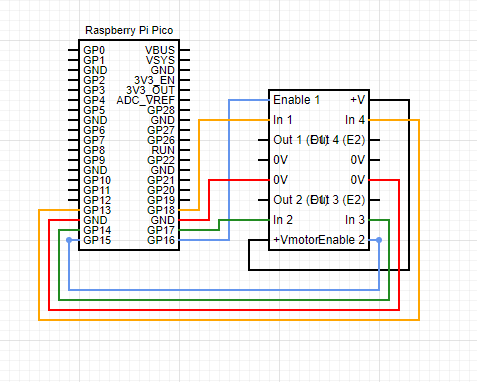

## Goal

Our goal for this project is to be able to create a fully autonomous, life sized chess game that people will be able to play using only voice commands. This project was inspired by the Wizard's Chess game in Harry Potter and the Philosopher's Stone. We will be exploring different hardware and software concepts, including engineering design, CAD, manufacturing, computer vision, and trajectory planning.

## Subsystems

### :wrench: Hardware
We are currently working on developing all 32 pieces for the game, as well as manufacturing the chess board ourselves. Navigate to our [hardware docs]() to understand where we are at in terms of our hardware progress.

#### Battery Team
The batteries team has been researching what types of batteries we need to power the robot as well as how to do it. Their mission is to successfully provide the amount of power to allow a full game of chess to run without needing any recharges. Currently, the upper bound that they have set for one full game is 2 hours.

#### CAD
The CAD team is utilizing Fusion 360 to create a model of the basic chess piece. They are also our go-to team for laser cutting, 3D printing, CNCing, and general manufacturing, especially when it comes to needing certain files.

### :computer: Software
We will be working on vision using apriltags to determine the positioning of each of the pieces on the board on an x,y coordinate plane and voice inputs to direct the pieces where to go.  This will all be controlled by the overarching Raspberry Pi 4 controller, intakes voice commands, determines valid moves, and calculates the correct trajectory for each of the pieces. Navigate to our [software docs]() to get a deeper dive into these concepts.

#### Computer Vision
This team is tasked with figuring out how to capture the position of all pieces on the board at all times. The current design is to use an overhead camera that will encompass the whole board, and then use edge detection software to determine the position of the robots on the board. With this information, we will be able to digitally map them on an xy-coordinate plane and perform the trajectory and pathing calculations correctly in order to move the correct chess pieces to the correct spots.

#### Voice Recognition
This team is tasked with implementing full voice recognition capabilities for the chess game. They are looking into different voice recognition libraries that will be the best to implement in order to assist the creation of the software needed. The voice recognition software will take different commands (ie: Knight to e4) and use the trajectory planner to convert them to a point on the plane for the piece to move to. To implement this, we are using Wit AI and the chess python library.

#### Running The Control Center
The environment to run the voice recognition and computer vision software has already been set up on the Raspberry Pi 4. We have used different libraries such as ``chess`` ``PyAudio`` ``speed_recognition`` and the Wit AI.

### :bulb: Electronics
In order for the robot to move, we are using a Raspberry Pico onboard, connected to the L293D Motor Driver shown in the circuit diagram below. The motors are connected through the in and out pins powered by Enable 1 and 2. 

We will also be connecting a 11.1V battery to the DC motors to power them. The Pico will be connected to an ESP8266 Wifi Module so that we can connect all the robots to each other across wifi networks and make sure that the control center can talk to them accordingly.

## Plans for the Future

We are planning on creating low-poly structures for each of the chess pieces and combining them with LED indicators to distinguish between the different pieces. We will also be looking into creating custom PCBs for each of the robots.
In terms of the actual robotics environment, we need to set up the wifi network for the picos to talk to each other, as well as connect them to the Raspberry Pi Control Center.